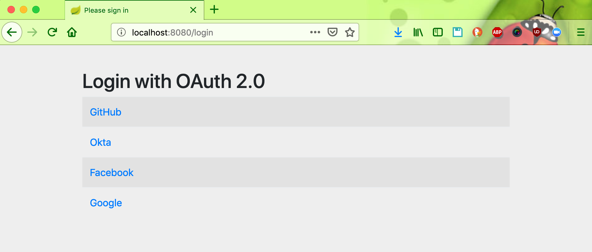
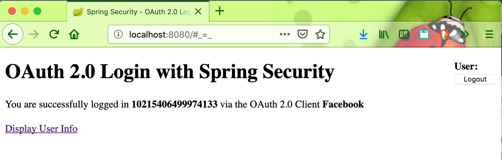
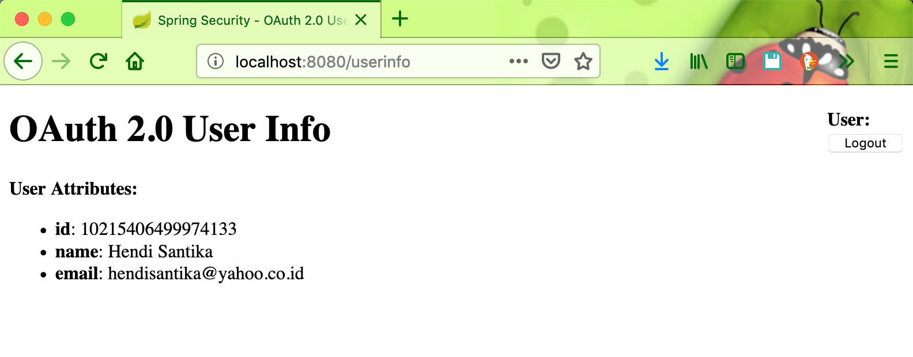
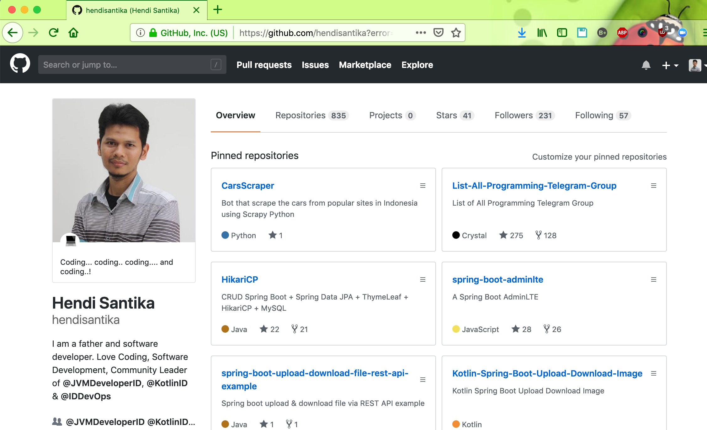
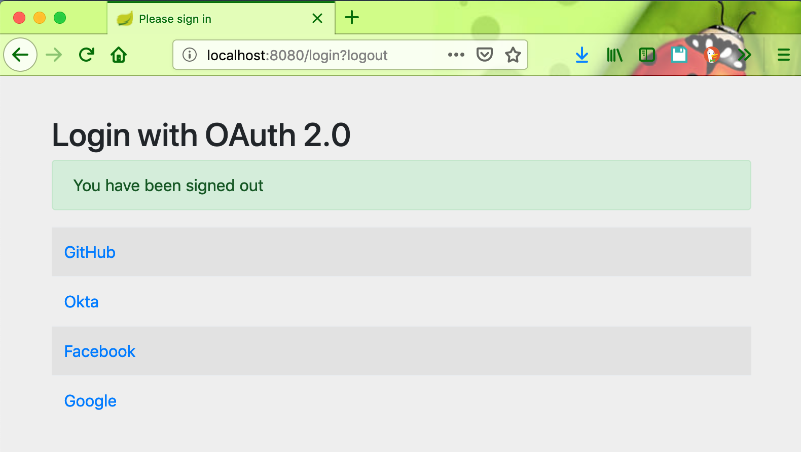

# springboot-oauth2-login

### Things to run locally

Clone repository:
```
https://github.com/hendisantika/springboot-oauth2-login.git
```

Go to the folder:
```
cd springboot-oauth2-login
```

Run the app:
```
mvn clean spring-boot:run
```

### Screen shot

#### Login page



#### Login Facebook





#### Github Login



#### Logout

